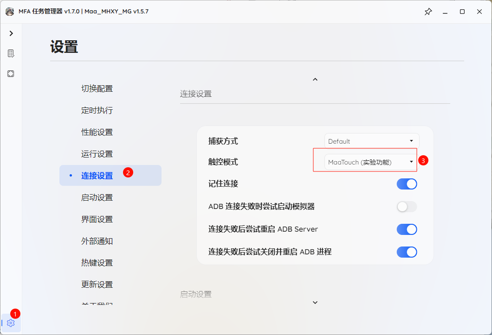
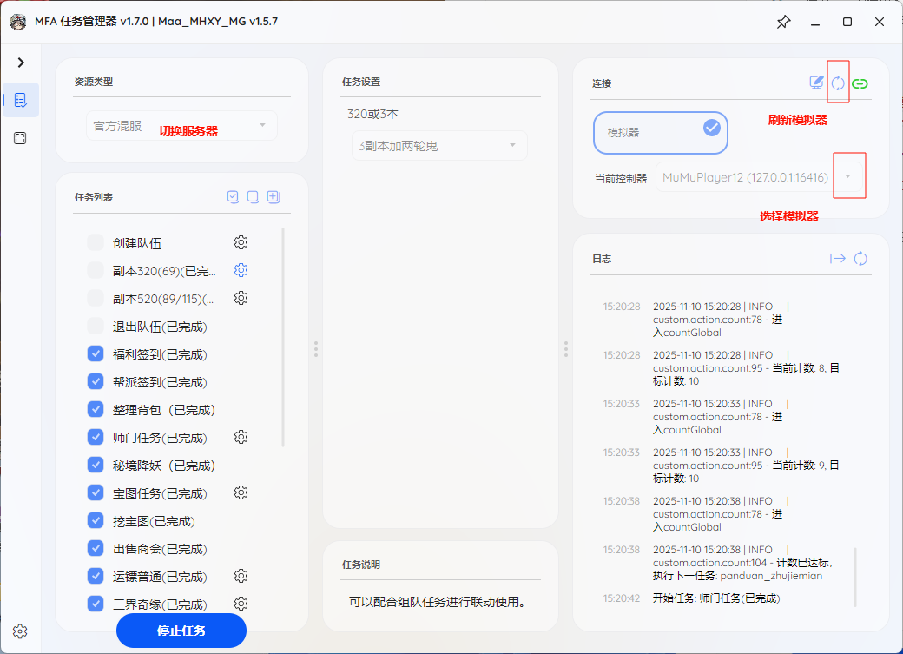
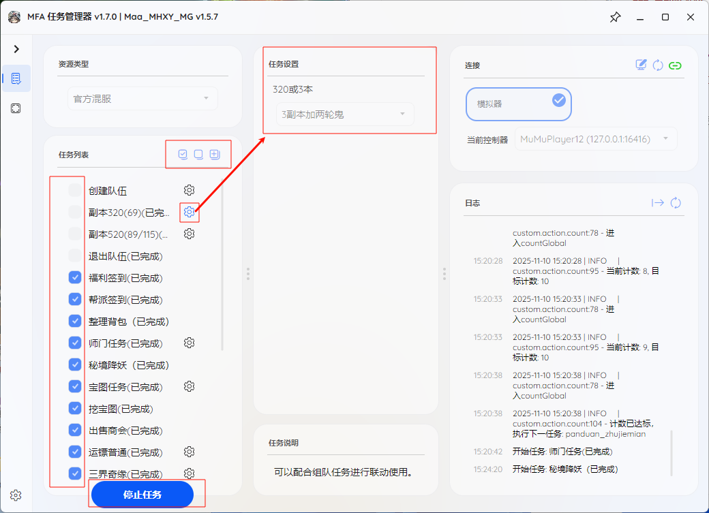

## 下载打包的程序

1.下载对应系统（Linux、win、macos）版本的X86，arm\
2.MUMU模拟器12（因用到快捷键，暂不支持雷电模拟器），建议调整设置：1280*720 240dpi，其他分辨率也能用。  \
3.运行启动MFAAvalonia.exe,请稍等待，第一次启动需要下载python运行环境\
4.安装vc_redist后在启动  
5.电脑缩放比例要求100%（影响文字识别），分辨率那个都可以，不影响使用。  \
6.

### 1.报错
一般是电脑缺少某些运行库，请安装一下  [vc_redist](https://aka.ms/vs/17/release/vc_redist.x64.exe)\

### 设置更改
调整触控模式为maatouch

# 功能说明

**1.因69以下账号操作逻辑的不同(弹窗较多)，所以本项目对69以下小号适配不完善。**  \

3.科举乡试，全部选a，或者智能答题（deepseek）\

4.必须关闭活动中右上角的眼睛

5.须勾选自动选择每日任务和自动完成任务

6.，**多开** ：请直接在解压一份文件，。

7.有的任务有说明和选项，点击齿轮进行查看

  --如有其他问题，请提lssues或反馈QQ群

### 测试
建议第一次使用本程序运行前，首先单独运行 “帮派签到” 测试，如无法运行请试运行[cmd教程](./CMD运行教程.md)
### 启动MFAWPF
MFAWPF主界面

### 1.选择任务，2.设置选择任务的配置项，3.启动。4

