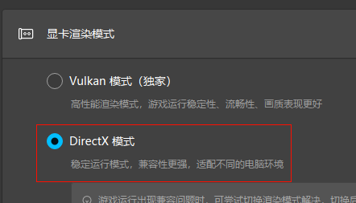
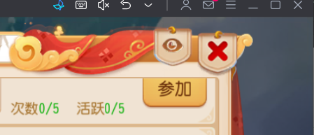
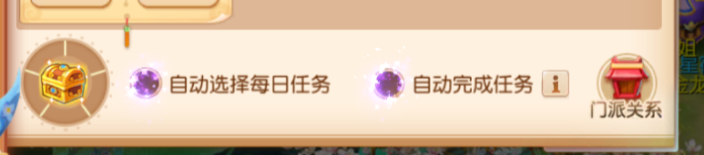

# 1.下载程序并设置

1.1下载对应系统（Linux、win、macos）版本的X86，arm程序，[下载地址](https://github.com/gitlihang/Maa_MHXY_MG/releases) 
1.2 软件主界面左下角设置→连接设置→触控模式，选择**MaaTouch** 

# 2.模拟器设置

1.1 最推荐MUMU模拟器（适配最好），兼容雷电模拟器，调整分辨率设置：**1280*720 240dpi**，其他16：9分辨率也能用。 

模拟器16：9分辨率

  1920x1080 (全高清，Full HD) 
  3840x2160 (超高清，4K) 
  2560x1440 (2K) 
  1280x720 (720P高清) 

1.2 显卡渲染模式选择**DirectX**模式，不要选择Vulkan模式. 

DirectX模式

# 3.游戏内设置

1.须关闭活动中右上角的眼睛

2.须勾选自动选择每日任务和自动完成任务

# 4.电脑设置
1.电脑缩放比例要求100%（影响文字识别），分辨率那个都可以，不影响使用。 
2.只有Windows电脑需安装[vc_redist](https://aka.ms/vs/17/release/vc_redist.x64.exe)点击前往下载地址 
3.需安装[.NET 10](https://dotnet.microsoft.com/zh-cn/download/dotnet/10.0)点击前往官方下载地址

# 5.报错

未安装vc_redist报错信息

# 6.其他

1.**多开** ：请直接在解压一份文件。

2.有的任务有说明和选项，点击齿轮进行查看

  --如有其他问题，请提lssues或反馈QQ群

#  7.启动并测试

1.首次启动 MFAAvalonia 时，Maa_MHXY_MG将进行初始化。在 <code>日志</code> 板块显示 “<strong>AgentServer 启动</strong>”后，直到看见 “<strong>任务已全部完成</strong>” 前，请不要点击 <code>停止任务</code> 。
 

2.建议第一次使用本程序运行前，首先单独运行 “**帮派签到**” 进行测试，如无法运行请试运行，请检查上述设置[1-4]

MFAAvalonia主界面展示

<blockquote></blockquote>

选择和设置任务配置项，并启动

<blockquote></blockquote>

